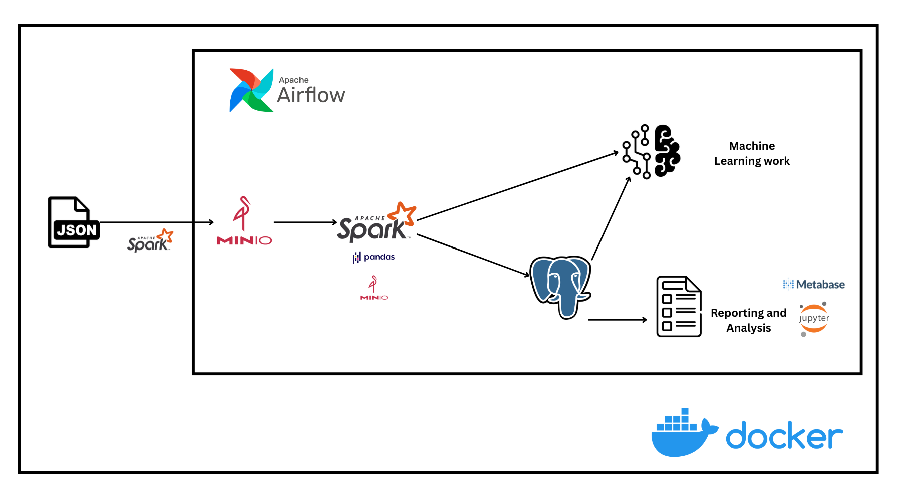

# Harvesting and Serving Amazon Review Data for Machine Learning and Analytics 

## 1. Overview

**Scenario:** A new supermarket is expanding its business through both physical branches and its own e-commerce platform. They recognize that user-generated data on large public e-commerce platforms like Amazon is extremely valuable. Product reviews and purchasing trends provide critical insights into consumer preferences and market trends. To leverage this, the company first needs to collect and transform the data to make it usable for end users. The end users in this context are the company’s machine learning engineers and data analysts.

---
## 2. Dataset
**Source**: https://amazon-reviews-2023.github.io/ \
**Sub-dataset for this project**: Grocery and Gourmet Food (7M+ Reviews)
### 🧾 User Reviews

| Field             | Type   | Description                                                                 |
|------------------|--------|-----------------------------------------------------------------------------|
| `rating`          | float  | Rating of the product (from 1.0 to 5.0).                                   |
| `title`           | str    | Title of the user review.                                                  |
| `text`            | str    | Text body of the user review.                                              |
| `images`          | list   | Images that users post after receiving the product.<br>Each image includes: `small_image_url`, `medium_image_url`, `large_image_url`. |
| `asin`            | str    | ID of the product.                                                         |
| `parent_asin`     | str    | Parent ID of the product. Products with different variations (color, size, etc.) often share the same parent ID. Use this to link with product metadata. |
| `user_id`         | str    | ID of the reviewer.                                                        |
| `timestamp`       | int    | Time of the review (Unix time).                                            |
| `verified_purchase` | bool | Indicates if the user purchased the product.                               |
| `helpful_vote`    | int    | Number of helpful votes the review received.                               |

---

### 🗂️ Item Metadata

| Field             | Type   | Description                                                                 |
|------------------|--------|-----------------------------------------------------------------------------|
| `main_category`   | str    | Main category (i.e., domain) of the product.                                |
| `title`           | str    | Name/title of the product.                                                  |
| `average_rating`  | float  | Average rating shown on the product page.                                   |
| `rating_number`   | int    | Total number of ratings the product has received.                           |
| `features`        | list   | Bullet-point list of product features.                                      |
| `description`     | list   | Description of the product.                                                 |
| `price`           | float  | Price in US dollars (at time of data crawling).                             |
| `images`          | list   | Images of the product (each includes `thumb`, `large`, `hi_res`).<br>The `variant` field indicates the image's position. |
| `videos`          | list   | Videos associated with the product (including `title` and `url`).           |
| `store`           | str    | Store name of the product.                                                  |
| `categories`      | list   | Hierarchical categories to which the product belongs.                       |
| `details`         | dict   | Product details such as materials, brand, sizes, etc.                       |
| `parent_asin`     | str    | Parent ID of the product.                                                   |
| `bought_together` | list   | Recommended product bundles frequently bought together.                     |

---
## 3. Project Structure


```bash
data-pipeline-amazon-review/
│
├── airflow/          # Airflow DAGs
├── dataset/          # Raw data 
├── src/              # ETL Scripts
```

---

## 4. Architecture



| Component         | Technology             |
|-------------------|------------------------|
| Orchestration     | Apache Airflow         |
| Distributed Data Processing | Apache Spark       |
| Object Storage    | MinIO (S3-compatible)  |
| Database          | PostgreSQL             |
| Visualization     | Metabase               |
| Testing   | Jupyter Notebook       |
| Containerization  | Docker & Docker Compose|


---
## 5. Getting Started
I use Docker to simulate a 3-node cluster (represented by 3 containers) named `spark-master`, `spark-worker-1`, and `spark-worker-2`. The purpose of this setup is to evaluate the performance of Spark when running in a distributed environment and to mimic a real-world scenario where large-scale data processing is not handled by a single machine.
### 5.1. Launch the System

```bash
git clone https://github.com/nka151203/data-pipeline-amazon-review.git
cd data-pipeline-amazon-review
docker compose build
docker compose up --build
```
```bash
cd dataset

wget https://mcauleylab.ucsd.edu/public_datasets/data/amazon_2023/raw review_categories/Grocery_and_Gourmet_Food.jsonl.gz 

mkdir -p ./meta_Grocery_and_Gourmet_Food

wget -O ./meta_Grocery_and_Gourmet_Food/meta_Grocery_and_Gourmet_Food.jsonl.gz https://mcauleylab.ucsd.edu/public_datasets/data/amazon_2023/raw/meta_categories/meta_Grocery_and_Gourmet_Food.jsonl.gz
```
```bash
# You are staying /dataset folder, please run some scripts to pre-processing this dataset including dividing and uploading to MinIO. Make sure you are still teaching Docker from the step above

# For windows
python -m venv venv
venv\Scripts\activate.bat
python dividing_dataset.py
python upload_to_s3.py
#For Linux/macOS
python3 -m venv venv
source venv/bin/activate
python dividing_dataset.py
python upload_to_s3.py
```
### 5.2. Access the Services

| Service        | URL                      | Default Credentials          |
|----------------|--------------------------|------------------------------|
| Airflow UI     | http://localhost:8080    | admin / admin                |
| Jupyter        | http://localhost:8888    | auto-generated token         |
| Metabase       | http://localhost:3000    | configured on first login    |
| MinIO Console  | http://localhost:9001    | minioadmin / minioadmin      |
| PostgreSQL     | http://localhost:5432           | user: postgres / password: postgres |

---

## 6. ETL Workflow

1. After **step 5.1**, you uploaded raw dataset into MinIO, let's check http://localhost:9001/raw-data-set
2. Access http://localhost:8081 local, navigate to the DAG named `transform_load_every_5_min`, and trigger it to automatically perform the data transformation and loading process for downstream purposes.
3. You can see some results which existed at http://localhost:9001/cleaned-review-data
5. Jupyter can be used for testing Spark jobs or querying PostgreSQL. Check it by accessing http://localhost:8888 and open  `data-pipeline-amazon-review\src\test\preview_table.ipynb`

---

## 📌 Notes

- Make sure raw datasets are available in the `dataset/` folder before running the pipeline.

---
## 🌚 Limitations and future work

- The data splitting and uploading steps to MinIO are still performed manually; however, integrating them into Airflow would not be appropriate since these steps only need to be executed once.

- With the data already cleaned and standardized, I will proceed to build suitable machine learning models and perform data analysis using Metabase.

---

## 📬 Contact
- Author: Nguyen Khac An
- Email: nka151203@gmail.com